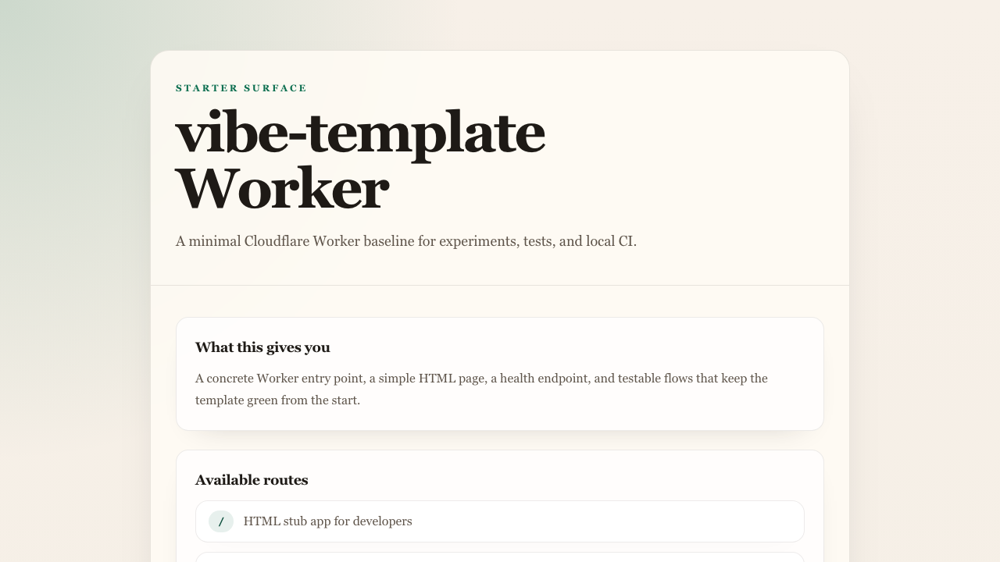

# social-media-scheduler

Private social media scheduler foundation for personal projects.

The repo currently provides:

- local auth with signed session cookies
- channel connection management for Bluesky, X, and LinkedIn
- per-channel posting schedules stored in D1
- encrypted credential storage for provider tokens
- optional scheduled R2 backups for recoverable app state

## What You Get

The current app is a private scheduler shell with four authenticated surfaces:

- `Queue` for schedule visibility and queue status
- `Compose` for account-specific drafting
- `History` for sent-post review
- `Settings` for channel connections and credentials

The product model is still intentionally lightweight, but the operational foundation is in place for real integrations.

## Getting Started

For setup and first run, start with [docs/setup.md](docs/setup.md).

In short:

1. Install dependencies with `npm install`.
2. Create the D1 database and update `wrangler.jsonc`.
3. Copy `.dev.vars.example` to `.dev.vars` and set `SESSION_SECRET`.
4. Run `npm run db:migrate`.
5. Create a local account with `npm run account:create -- --name "Scheduler Admin" --password "change-me" --role editor`.
6. Start the app with `npm run dev`.

Local development in this repo targets macOS.

## Documentation

- [docs/setup.md](docs/setup.md): setup and first run
- [docs/development.md](docs/development.md): development workflow, verification, and local CI
- [docs/backups.md](docs/backups.md): backup configuration and restore notes
- [docs/adrs/README.md](docs/adrs/README.md): architecture decisions
- [specs/README.md](specs/README.md): feature and architecture specs
- [AGENTS.md](AGENTS.md): project-specific agent instructions

## Current Scope

- `GET /login` handles local sign-in.
- `GET /`, `GET /compose`, `GET /history`, and `GET /settings` are authenticated app surfaces.
- `POST /settings/channels` stores validated channel connections with encrypted token fields.
- `POST /posting-schedule` stores per-channel schedule state in D1.
- `GET /api/health` provides a stable health response for tooling.

## Notes

- The pinned runtime versions live in `package.json`.
- Detailed development commands and quality-gate guidance live in [docs/development.md](docs/development.md).
- Detailed setup and environment configuration live in [docs/setup.md](docs/setup.md).
